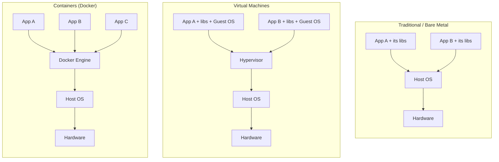
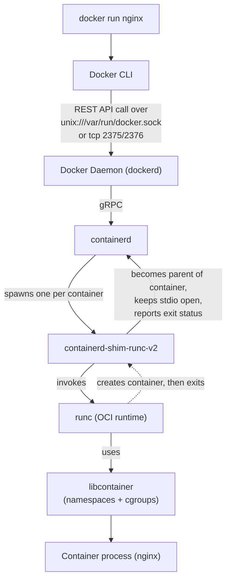

# Docker — Day 1 Notes
**Topic:** Docker Fundamentals, Architecture, Basic Commands
**Tags:** #docker #devops #containers

**Covered today:**
1. Dockerized vs non-Dockerized applications
2. Docker architecture — CLI, daemon, containerd, shim, runc, libcontainer, ports 2375/2376
3. DIND vs KIND
4. Basic Docker commands
5. Port publishing with `-p`

---

## 1. How Docker Changes Application Deployment

### The problem without Docker
Traditionally, an application is deployed one of two ways:

- **Directly on a host (bare metal/VM):** you install the OS, runtime (say Node/Python/Java), system libraries, and app manually. Every environment (dev, staging, prod) has to be configured to match *exactly*, or you get the classic **"works on my machine"** problem — different library versions, different OS patches, different env vars.
- **On a Virtual Machine:** each app (or app + dependencies) sits on its own full guest OS, on top of a hypervisor. This gives strong isolation but each VM carries the weight of an entire OS kernel, boot process, and OS-level resource usage.

### What changes with Docker
Docker packages the **application + its exact dependencies + config** into an **image** — an immutable, versioned artifact. That image runs identically on your laptop, the CI server, and production, because it *is* the same filesystem and dependency set every time. Containers share the **host's kernel** instead of carrying their own, so they start in milliseconds/seconds instead of minutes, and you can run far more containers than VMs on the same hardware.

### Architecture comparison



**Text version (if diagram doesn't render):**
```
BARE METAL              VIRTUAL MACHINES                CONTAINERS
--------------          -----------------------         -----------------------
App A, App B            App A+GuestOS | App B+GuestOS   App A | App B | App C
   (libs)                    (own kernel each)              (share host kernel)
Host OS                       Hypervisor                     Docker Engine
Hardware                      Host OS -> Hardware             Host OS -> Hardware
```

### Key differences

| Aspect | Without Docker (bare/VM) | With Docker |
|---|---|---|
| Kernel | Own kernel per VM | Shared host kernel |
| Startup time | Minutes (VM boot) | Seconds/milliseconds |
| Resource overhead | High (full OS per instance) | Low (just process + libs) |
| Portability | "Works on my machine" issues | Same image runs everywhere |
| Density (per host) | Low | High |
| Versioning | Manual/config-management | Image tags (immutable artifacts) |
| Isolation strength | Strong (separate kernel) | Process-level (namespaces/cgroups) |

> Interview angle: if asked "isn't a container just a lightweight VM?" — no. A container is an **isolated process** on the host, not a separate machine. That distinction is the basis of almost every Docker architecture question.

---

## 2. Docker Architecture — Deep Dive

Docker is **not one program**. It's a client–server system made of layered components, each with a specific job. This layering is why Docker can restart itself without killing your running containers.

### 2.1 The components

| Component | Role |
|---|---|
| **Docker CLI** | The `docker` command you type. It's just a client — it doesn't run containers itself. |
| **Docker Daemon (`dockerd`)** | Background service that receives CLI/API requests, manages images, networks, volumes, and delegates actual container execution to containerd. |
| **containerd** | High-level container runtime (donated to CNCF, also what Kubernetes talks to via CRI). Manages container lifecycle, image pulls, storage, and talks to the shim/runc layer. |
| **containerd-shim (containerd-shim-runc-v2)** | A small long-lived process, **one per running container**. Sits between containerd and the container process. |
| **runc** | The actual OCI-compliant low-level runtime. It creates the container, then **exits** — it's not long-running. |
| **libcontainer** | A Go library (used internally by runc) that does the real kernel-level work: setting up namespaces, cgroups, capabilities, mounts. |

### 2.2 Full request flow



**Text version:**
```
docker CLI
   │  REST API (unix socket, or tcp 2375/2376)
   ▼
Docker Daemon (dockerd)
   │  gRPC
   ▼
containerd  (manages lifecycle, images, storage)
   │  spawns ONE shim PER container
   ▼
containerd-shim-runc-v2   <── stays alive, becomes container's parent
   │  invokes
   ▼
runc  (OCI runtime — creates the container, then exits)
   │  uses
   ▼
libcontainer  (Go library: sets up namespaces, cgroups, capabilities)
   │
   ▼
Container process (e.g. nginx, running as PID 1 inside its namespace)
```

### 2.3 Why the shim exists (commonly missed, commonly asked in interviews)

`runc` is deliberately **not long-running** — it creates the container and exits immediately. If `containerd` itself were the direct parent of every container process, then restarting or upgrading `containerd`/`dockerd` would kill every running container (their parent process would die).

The shim solves this:
- It becomes the **actual OS-level parent** of the container process, not `dockerd` or `containerd`.
- It keeps **stdin/stdout/stderr** open so `docker logs` / `docker attach` keep working.
- It acts as a reaper for zombie processes inside that container.
- It reports the container's **exit code** back to containerd.
- Because of this, containers survive a `dockerd`/`containerd` restart or upgrade — this is what "daemonless containers" means.

### 2.4 libcontainer, in detail

Originally, Docker used **LXC (LinuxContainers)** as its execution driver. In 2014, Docker wrote **libcontainer** — a native Go library — to remove that external dependency and get direct control over the Linux kernel primitives. It's consumed as a linked-in Go package by `runc`, not run as a separate process.

What libcontainer actually configures on `runc`'s behalf:
- **Namespaces** — `pid`, `net`, `mnt`, `uts`, `ipc`, `user` → gives the container its own view of processes, network interfaces, filesystem mounts, hostname, IPC, and (optionally) user/group IDs.
- **cgroups (control groups)** — limits/accounts for CPU, memory, block I/O, so one container can't starve the host or other containers.
- **Capabilities** — drops unneeded root privileges (e.g., a container doesn't need `CAP_SYS_ADMIN` by default).
- **Rootfs/mount setup** — assembles the container's filesystem from image layers.
- **Security profiles** — AppArmor/SELinux integration.

> Mental model: **runc is the "driver," libcontainer is the "engine"** that actually talks to the Linux kernel.

### 2.5 Ports 2375 and 2376

By default, the Docker daemon listens on a **Unix socket** (`/var/run/docker.sock`) — not a network port at all. It can *also* be configured to listen on TCP for remote access:

| Port | Protocol | Security | Use case |
|---|---|---|---|
| **2375** | Plain HTTP | ❌ No encryption, no authentication | Remote docker API access — anyone who can reach it has effectively **root on the host** (they can mount the host filesystem into a container). Should never be exposed on an untrusted network. |
| **2376** | HTTPS | ✅ TLS, with client certificate verification | Secure remote API access — used by tools like `docker context`, CI/CD runners, and remote build agents. |

> This is a genuinely important security fact for a DevOps role: an exposed 2375 with no firewall is one of the most common real-world Docker misconfigurations that gets hosts compromised.

---

## 3. DIND vs KIND

| | **DIND** (Docker-in-Docker) | **KIND** (Kubernetes IN Docker) |
|---|---|---|
| What it is | Running a Docker daemon *inside* a container | Running a full Kubernetes cluster where each "node" is a Docker container |
| Typical image | `docker:dind` | `kindest/node` (managed by the `kind` CLI) |
| Common use | CI/CD pipelines (GitLab CI, Jenkins) that need to build/run images in an isolated job | Local Kubernetes dev/testing, testing Kubernetes itself, CI for k8s tooling |
| How it's run | Usually needs `--privileged` mode | `kind create cluster` handles container creation for you |
| Gotcha | True DIND (privileged, nested storage driver) has known reliability/security quirks. A common alternative is **DooD (Docker-outside-of-Docker)**: mount the host's socket into the container with `-v /var/run/docker.sock:/var/run/docker.sock` — containers you "spawn from inside" are actually created as siblings on the **host's** Docker daemon, not truly nested. | Nodes are containers, so `docker ps` on the host shows your "cluster nodes" as regular containers even while `kubectl get nodes` shows them as Kubernetes nodes. |

```bash
# True DIND (isolated nested daemon) — needs privileged mode
docker run --privileged --name my-dind -d docker:dind

# DooD — reuses the host's own daemon (lighter, commonly preferred in CI)
docker run -it --rm -v /var/run/docker.sock:/var/run/docker.sock docker sh
# now `docker ps` inside this container shows the HOST's containers
```

---

## 4. Basic Docker Commands

| Command | What it does |
|---|---|
| `docker container ls` / `docker ps` | Lists **running** containers (`ps` is the legacy alias, both do the same thing) |
| `docker container ls -a` / `docker ps -a` | Lists **all** containers — running + stopped |
| `docker image ls` / `docker images` | Lists locally cached images (repo, tag, image ID, size) |
| `docker pull <image>` | Downloads image layers from a registry (default: Docker Hub) into the local cache — does **not** run it |
| `docker info` | Shows system-wide daemon info: storage driver, cgroup driver, number of containers/images, kernel version — great diagnostic command |
| `docker run nginx` | Pulls the image if missing, then creates **and starts** a container in the foreground (attached to your terminal) |
| `docker container run -itd --name dbcon1 nginx` | Same, but detached + named + interactive tty allocated |
| `docker container run -itd --name dbcon1 -p 8009:80 nginx` | Same, plus maps host port 8009 → container port 80 |

**Flag breakdown for `-itd`:**
- `-i` → keep STDIN open (interactive)
- `-t` → allocate a pseudo-TTY
- `-d` → detached mode (runs in background, returns your terminal immediately)
- `--name` → gives the container a human-readable name instead of a random one (e.g. `happy_turing`)

```bash
docker container ls
docker container ls -a
docker image ls
docker pull nginx
docker info
docker run nginx
docker container run -itd --name dbcon1 nginx
docker container run -itd --name dbcon1 -p 8009:80 nginx
```

> ⚠️ **Catch from today's examples:** both example commands reuse `--name dbcon1`. Container names must be **unique** — if the first `dbcon1` is still around (even stopped), the second command will fail with:
> `docker: Error response from daemon: Conflict. The container name "/dbcon1" is already in use...`
> Fix: `docker rm -f dbcon1` before re-running, or give the second container a different name.

---

## 5. Understanding `-p` (Port Publishing) In Depth

By default, every container gets its **own private network namespace** with its own internal IP (usually on the `docker0` bridge, e.g. `172.17.0.x`). This means even though nginx is listening on port 80 *inside* the container, that port is **not reachable from outside** — the container's network is isolated from the host's.

`-p <host_port>:<container_port>` explicitly **publishes** a mapping: traffic hitting the host on `host_port` gets forwarded to `container_port` inside the container's namespace.

```bash
docker container run -itd --name dbcon1 -p 8009:80 nginx
# host:8009  ─────────►  container's internal IP : 80
```

Under the hood (Linux, default bridge network), Docker manages this using **iptables NAT rules** — roughly:
```
-A DOCKER -d 0/0 -p tcp --dport 8009 -j DNAT --to-destination 172.17.0.2:80
```
so traffic to `host:8009` gets DNAT'ed to the container's internal address on port 80.

**`EXPOSE` (in a Dockerfile) vs `-p` (at runtime) — don't confuse these:**
- `EXPOSE 80` in a Dockerfile is just **documentation/metadata** — it tells you and tools like `docker run -P` which port the app *intends* to use. It does **not** actually publish anything.
- `-p` at `docker run` time is what **actually** opens the mapping so the outside world (or your host) can reach it.

Without `-p`, the app inside the container works fine — it's just unreachable from outside the container's own network namespace.

---

## 6. DIY Exercises — Do These Before Next Lecture

**Architecture**
1. Run `docker version` and identify the "Client" vs "Server" sections in the output — map each to what you learned about CLI vs daemon.
2. Start a container (`docker run -d --name webtest nginx`), then run `ps aux | grep nginx` **on the host**. Notice the nginx process is visible directly on the host (proof containers share the host kernel). Then compare with `docker exec -it webtest ps aux` run *inside* the container.
3. Restart the docker service while a container is running (`sudo systemctl restart docker`) and check `docker ps` afterward — relate the result to the shim's role in "daemonless containers."
4. Run `docker inspect webtest` and look for cgroup/namespace-related fields; separately check `/proc/<container_pid>/ns/` on the host to see the actual namespace links.

**Commands & Ports**
5. Run two nginx containers with different names, mapped to two different host ports (e.g. 8010 and 8011). Curl both. Then try running one **without** `-p` and confirm you cannot reach it from the host.
6. (Linux) After publishing a port, inspect the NAT rule Docker created: `sudo iptables -t nat -L -n | grep <port>`.
7. Deliberately reproduce the `--name` conflict from Section 4, then fix it.

**DIND / KIND**
8. Try the DooD example from Section 3 — run a container with the host's docker socket mounted, and run `docker ps` from inside it. Confirm it shows the **host's** containers, not a separate nested set.
9. Install `kind`, run `kind create cluster`, then run `docker ps` on the host and `kubectl get nodes` — observe that the "Kubernetes node" is really just a Docker container.

**Security awareness**
10. In a disposable/lab VM only, temporarily start dockerd with `-H tcp://127.0.0.1:2375` and hit `curl http://127.0.0.1:2375/version`. Observe the raw, unauthenticated API response — then reason through why this must never be reachable from an untrusted network.

---

## 7. Quick Recap Cheat Sheet

| Command | One-liner |
|---|---|
| `docker container ls` | Running containers |
| `docker container ls -a` | All containers |
| `docker image ls` | Local images |
| `docker pull ` | Download image only |
| `docker info` | Daemon/system diagnostics |
| `docker run ` | Run in foreground |
| `docker run -itd --name X ` | Run detached, named |
| `docker run -itd --name X -p H:C ` | Run detached, named, port-published |

**Architecture flow, one line:** CLI → dockerd → containerd → shim (per-container, stays alive) → runc (creates, then exits) → libcontainer (namespaces/cgroups) → your process.
